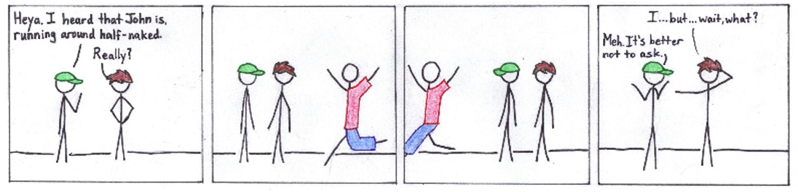
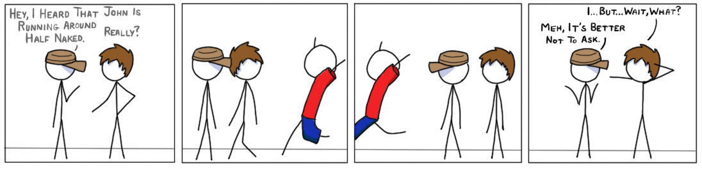

First comic is now officially up [here](http://www.http://drifterswithpencils.com/archive/half-naked).

You know, for the first comic that was ever published and shown to other people, this was a pretty good one. This joke always made me laugh, even when I said it. Just the thought of someone being half naked on the left side makes me smile. 

Here's the comparison between the original and the "remastered":
    
    

There's an obvious quality difference here. The old version probably would have taken a day, while the new version took an hour or two. This was probably due to how long it took to make squares in a physical medium. Turns out that making the frames takes up the most amount of time. 

The proportions are also way different. The old version has (arguably) more realistic proportions, minus the random neck lengths. The new version has larger heads, but it feels a lot more natural for the style. 

Oh, and the shading. The wonderous wonderous shading. Shading is phenomenal. It's not that I'm even any good at it. It's just fun. 

But the old version has its charms. The new version is nice and all, but it almost feels...too produced. The old version, being drawn with paper and ink pens and pencils crayons, has a sort of nostalgic look. At least for me. It's been about 4 years since I've seen it. 

It's nice to look back at what started it all off, and see how far you've quote unquote improved. It gives you perspective, that's for sure. 

I'll keep going back to those comics, and remake them. But I'll be sure to put up a post showing the old version as well, and see the progression even within the old comics. That should be fun. Maybe. 

-Jan

