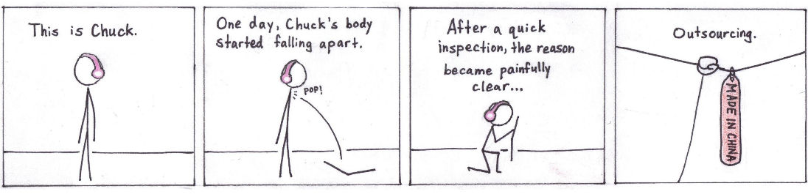

Observe the comic [in its natural habitat](http://drifterswithpencils.com/archive/outsourcing).

This pace of one comic a day seems unsustainable. I think it's best not to worry about that and just enjoy it though. Like the Calgary Flames run of 2014-2015...sigh. This year is rough. 

Anyway, the comic. Second one ever published. Extremely simple actually. You can check the differences between the two below:

Not much of a difference, really. My proportions got a lot closer to what I do now than the first one. You will actually see that the next two comics will seem to revert back to the proportions of the first one. That's because I made these comics three at a time. I believe this was the last of the three to be made, so I was still progressing there. 

The joke came from the fact that EVERYTHING was being made in China. Computers, TVs, babies. Just name it, it was probably made there. Simple. 

Next comic will probably be an old one as well. Then I'll get started on a new comic that involves a lot of words. Like, a lot. 

-Jan