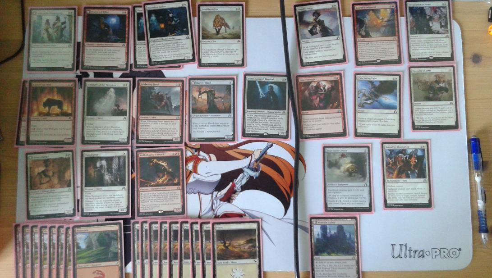

Hello, and welcome to a Magic: the Gathering prerelease report. For this report, I'll be discussing my deck used for the Shadows over Innistrad prerelease on April 2nd. (Well, at least the one I went to.)

In case you're in the dark, a prerelease event basically involves you opening up 6 packs, and making your best 40 card deck out of your draft. This particular event was a four round round-robin tournament, with placing determined by your overall record. So, here we go. 

##### The Deck
###### Creature (14)
1 [Avacynian Missionaries](http://gatherer.wizards.com/Pages/Card/Details.aspx?multiverseid=409743 "Avacynian Missionaries 3W (4)
Creature — Human Cleric (3/3)
At the beginning of your end step, if Avacynian Missionaries is equipped, transform it.
~
Lunarch Inquisitors (0)
Creature — Human Cleric (4/4)
When this creature transforms into Lunarch Inquisitors, you may exile another target creature until Lunarch Inquisitors leaves the battlefield.")  
1 [Convicted Killer](http://gatherer.wizards.com/Pages/Card/Details.aspx?multiverseid=409900 "Convicted Killer 2R (3)
Creature — Human Werewolf (2/2)
At the beginning of each upkeep, if no spells were cast last turn, transform Convicted Killer.
~
Branded Howler (0)
Creature — Werewolf (4/4)
At the beginning of each upkeep, if a player cast two or more spells last turn, transform Branded Howler.")  
2 [Dauntless Cathar](http://gatherer.wizards.com/Pages/Card/Details.aspx?multiverseid=409749 "Dauntless Cathar 2W (3)
Creature — Human Soldier (3/2)
1W, Exile Dauntless Cathar from your graveyard: Put a 1/1 white Spirit creature token with flying onto the battlefield. Activate this ability only any time you could cast a sorcery.")  
1 [Devilthorn Fox](http://gatherer.wizards.com/Pages/Card/Details.aspx?multiverseid=409752 "Devilthorn Fox 1W (2)
Creature — Fox (3/1)")  
2 [Ember-Eye Wolf](http://gatherer.wizards.com/Pages/Card/Details.aspx?multiverseid=409906 "Ember-Eye Wolf 1R (2)
Creature — Wolf (1/2)
Haste
1R: Ember-Eye Wolf gets +2/+0 until end of turn.")  
1 [Emissary of the Sleepless](http://gatherer.wizards.com/Pages/Card/Details.aspx?multiverseid=409755  "Emissary of the Sleepless 4W (5)
Creature — Spirit (2/4)
Flying
When Emissary of the Sleepless enters the battlefield, if a creature died this turn, put a 1/1 white Spirit creature token with flying onto the battlefield.")  
1 [Gibbering Fiend](http://gatherer.wizards.com/Pages/Card/Details.aspx?multiverseid=409915 "Gibbering Fiend 1R (2)
Creature — Devil (2/1)
When Gibbering Fiend enters the battlefield, it deals 1 damage to each opponent.
Delirium — At the beginning of each opponent's upkeep, if there are four or more card types among cards in your graveyard, Gibbering Fiend deals 1 damage to that player.")  
1 [Harvest Hand](http://gatherer.wizards.com/Pages/Card/Details.aspx?multiverseid=410021 "Harvest Hand 3 (3)
Artifact Creature — Scarecrow (2/2)
When Harvest Hand dies, return it to the battlefield transformed under your control.
~
Scrounged Scythe (0)
Artifact — Equipment
Equipped creature gets +1/+1.
As long as equipped creature is a Human, it has menace. (It can't be blocked except by two or more creatures.)
Equip 2")  
1 [Odric, Lunarch Marshal](http://gatherer.wizards.com/Pages/Card/Details.aspx?multiverseid=409770 "Odric, Lunarch Marshal 3W (4)
Legendary Creature — Human Soldier (3/3)
At the beginning of each combat, creatures you control gain first strike until end of turn if a creature you control has first strike. The same is true for flying, deathtouch, double strike, haste, hexproof, indestructible, lifelink, menace, reach, skulk, trample, and vigilance.")  
1 [Pious Evangel](http://gatherer.wizards.com/Pages/Card/Details.aspx?multiverseid=409773 "Pious Evangel 2W (3)
Creature — Human Cleric (2/2)
Whenever Pious Evangel or another creature enters the battlefield under your control, you gain 1 life.
2, Tap, Sacrifice another permanent: Transform Pious Evangel.
~
Wayward Disciple (0)
Creature — Human Cleric (2/4)
Whenever Wayward Disciple or another creature you control dies, target opponent loses 1 life and you gain 1 life.")  
1 [Topplegeist](http://gatherer.wizards.com/Pages/Card/Details.aspx?multiverseid=409785 "Topplegeist W (1)
Creature — Spirit (1/1)
Flying
When Topplegeist enters the battlefield, tap target creature an opponent controls.
Delirium — At the beginning of each opponent's upkeep, if there are four or more card types among cards in your graveyard, tap target creature that player controls.")  
1 [Wolf of Devil's Breach](http://gatherer.wizards.com/Pages/Card/Details.aspx?multiverseid=409949 "Wolf of Devil's Breach 3RR (5)
Creature — Elemental Wolf (5/5)
Whenever Wolf of Devil's Breach attacks, you may pay 1R and discard a card. If you do, Wolf of Devil's Breach deals damage to target creature or planeswalker equal to the discarded card's converted mana cost.")  

###### Sorcery (3)
1 [Angelic Purge](http://gatherer.wizards.com/Pages/Card/Details.aspx?multiverseid=409739 "Angelic Purge 2W (3)
Sorcery
As an additional cost to cast Angelic Purge, sacrifice a permanent.
Exile target artifact, creature, or enchantment.")  
1 [Avacyn's Judgment](http://gatherer.wizards.com/Pages/Card/Details.aspx?multiverseid=409895 "Avacyn's Judgment 1R (2)
Sorcery
Madness XR (If you discard this card, discard it into exile. When you do, cast it for its madness cost or put it into your graveyard.)
Avacyn's Judgment deals 2 damage divided as you choose among any number of target creatures and/or players. If Avacyn's Judgment's madness cost was paid, it deals X damage divided as you choose among those creatures and/or players instead.")  
1 [Declaration in Stone](http://gatherer.wizards.com/Pages/Card/Details.aspx?multiverseid=409750 "Declaration in Stone 1W (2)
Sorcery
Exile target creature and all other creatures its controller controls with the same name as that creature. That player investigates for each nontoken creature exiled this way.")  

###### Instant (3)
1 [Inner Struggle](http://gatherer.wizards.com/Pages/Card/Details.aspx?multiverseid=409921 "Inner Struggle 3R (4)
Instant
Target creature deals damage to itself equal to its power.")  
1 [Puncturing Light](http://gatherer.wizards.com/Pages/Card/Details.aspx?multiverseid=409775 "Puncturing Light 1W (2)
Instant
Destroy target attacking or blocking creature with power 3 or less.")  
1 [Strength of Arms](http://gatherer.wizards.com/Pages/Card/Details.aspx?multiverseid=409780 "Strength of Arms W (1)
Instant
Target creature gets +2/+2 until end of turn. If you control an Equipment, put a 1/1 white Human Soldier creature token onto the battlefield.")  

###### Artifact (1)
1 [True-Faith Censer](http://gatherer.wizards.com/Pages/Card/Details.aspx?multiverseid=410035 "True-Faith Censer 2 (2)
Artifact — Equipment
Equipped creature gets +1/+1 and has vigilance.
As long as equipped creature is a Human, it gets an additional +1/+0.
Equip 2 (2: Attach to target creature you control. Equip only as a sorcery.)")  

###### Enchantment (1)
1 [Bound by Moonsilver](http://gatherer.wizards.com/Pages/Card/Details.aspx?multiverseid=409745 "Bound by Moonsilver 2W(3)
Enchantment — Aura
Enchant creature
Enchanted creature can't attack, block, or transform.
Sacrifice another permanent: Attach Bound by Moonsilver to target creature. Activate this ability only any time you could cast a sorcery and only once each turn.")  

###### Land (18)
8 [Mountain](http://gatherer.wizards.com/Pages/Card/Details.aspx?multiverseid=143626 "Mountain (0)
Basic Land — Mountain
R")  
9 [Plains](http://gatherer.wizards.com/Pages/Card/Details.aspx?multiverseid=158236 "Plains (0)
Basic Land — Plains
W
")  
1 [Westvale Abbey](http://gatherer.wizards.com/Pages/Card/Details.aspx?multiverseid=410049 "Westvale Abbey (0)
Land
Tap: Add Colorless to your mana pool.
5, Tap, Pay 1 life: Put a 1/1 white and black Human Cleric creature token onto the battlefield.
5, Tap, Sacrifice five creatures: Transform Westvale Abbey, then untap it.
~
Ormendahl, Profane Prince (0)
Legendary Creature — Demon (9/7)
Flying, lifelink, indestructible, haste")  

##### The Build 

Man, was I excited as I got to my local card shop and plopped down in a chair. It's been a while since I've been to a prerelease, and I was hoping to get some good results. Obviously, this couldn't go badly...

As a player that tends to steer towards white, I was hoping to see a large bomb. Say...[Archangel Avacyn](http://gatherer.wizards.com/Pages/Card/Details.aspx?multiverseid=409741 "Archangel Avacyn 3WW (5)
Legendary Creature — Angel (4/4)
Flash
Flying, vigilance
When Archangel Avacyn enters the battlefield, creatures you control gain indestructible until end of turn.
When a non-Angel creature you control dies, transform Archangel Avacyn at the beginning of the next upkeep.
~
Avacyn, the Purifier (0)
Legendary Creature — Angel (6/5)
Flying
When this creature transforms into Avacyn, the Purifier, it deals 3 damage to each other creature and each opponent.")? 

 

Unfortunately, that didn't happen. However, there was enough usable white cards to start building in it. Mainly, the [Bound by Moonsilver](http://gatherer.wizards.com/Pages/Card/Details.aspx?multiverseid=409745 "Bound by Moonsilver 2W(3)
Enchantment — Aura
Enchant creature
Enchanted creature can't attack, block, or transform.
Sacrifice another permanent: Attach Bound by Moonsilver to target creature. Activate this ability only any time you could cast a sorcery and only once each turn.") and [Declaration in Stone](http://gatherer.wizards.com/Pages/Card/Details.aspx?multiverseid=409750 "Declaration in Stone 1W (2)
Sorcery
Exile target creature and all other creatures its controller controls with the same name as that creature. That player investigates for each nontoken creature exiled this way.") served as good hard removal. 

However, this left my early game and late game creatures rather lacking. My blue, aside from [Geralf's Masterpiece](http://gatherer.wizards.com/Pages/Card/Details.aspx?multiverseid=409808 "Geralf's Masterpiece 3UU (5)
Creature — Zombie Horror (7/7)
Flying
Geralf's Masterpiece gets -1/-1 for each card in your hand.
3U, Discard three cards: Return Geralf's Masterpiece from your graveyard to the battlefield tapped."), wasn't that strong. Likewise, my black creatures weren't terribly strong. Normally, I'd choose green here. However, there were two red bombs that changed my mind; [Wolf of Devil's Breach](http://gatherer.wizards.com/Pages/Card/Details.aspx?multiverseid=409949 "Wolf of Devil's Breach 3RR (5)
Creature — Elemental Wolf (5/5)
Whenever Wolf of Devil's Breach attacks, you may pay 1R and discard a card. If you do, Wolf of Devil's Breach deals damage to target creature or planeswalker equal to the discarded card's converted mana cost.") and [Avacyn's Judgment](http://gatherer.wizards.com/Pages/Card/Details.aspx?multiverseid=409895 "Avacyn's Judgment 1R (2)
Sorcery
Madness XR (If you discard this card, discard it into exile. When you do, cast it for its madness cost or put it into your graveyard.)
Avacyn's Judgment deals 2 damage divided as you choose among any number of target creatures and/or players. If Avacyn's Judgment's madness cost was paid, it deals X damage divided as you choose among those creatures and/or players instead."). 

 

I knew [Wolf of Devil's Breach](http://gatherer.wizards.com/Pages/Card/Details.aspx?multiverseid=409949 "Wolf of Devil's Breach 3RR (5)
Creature — Elemental Wolf (5/5)
Whenever Wolf of Devil's Breach attacks, you may pay 1R and discard a card. If you do, Wolf of Devil's Breach deals damage to target creature or planeswalker equal to the discarded card's converted mana cost.") would put in work, and if I got the wombo combo with [Avacyn's Judgment](http://gatherer.wizards.com/Pages/Card/Details.aspx?multiverseid=409895 "Avacyn's Judgment 1R (2)
Sorcery
Madness XR (If you discard this card, discard it into exile. When you do, cast it for its madness cost or put it into your graveyard.)
Avacyn's Judgment deals 2 damage divided as you choose among any number of target creatures and/or players. If Avacyn's Judgment's madness cost was paid, it deals X damage divided as you choose among those creatures and/or players instead."), it would be a massive tempo swing. Even without the combo, [Avacyn's Judgment](http://gatherer.wizards.com/Pages/Card/Details.aspx?multiverseid=409895 "Avacyn's Judgment 1R (2)
Sorcery
Madness XR (If you discard this card, discard it into exile. When you do, cast it for its madness cost or put it into your graveyard.)
Avacyn's Judgment deals 2 damage divided as you choose among any number of target creatures and/or players. If Avacyn's Judgment's madness cost was paid, it deals X damage divided as you choose among those creatures and/or players instead.") is flexible removal, and [Wolf of Devil's Breach](http://gatherer.wizards.com/Pages/Card/Details.aspx?multiverseid=409949 "Wolf of Devil's Breach 3RR (5)
Creature — Elemental Wolf (5/5)
Whenever Wolf of Devil's Breach attacks, you may pay 1R and discard a card. If you do, Wolf of Devil's Breach deals damage to target creature or planeswalker equal to the discarded card's converted mana cost.") is a 5/5 body with pseudo-evasion. As well, [Ember-Eye Wolf](http://gatherer.wizards.com/Pages/Card/Details.aspx?multiverseid=409906 "Ember-Eye Wolf 1R (2)
Creature — Wolf (1/2)
Haste
1R: Ember-Eye Wolf gets +2/+0 until end of turn.") filled out my curve at the 2-drop spot. 

I added a few Equipment cards to strengthen my somewhat weak board, as well as to synergize with [Avacynian Missionaries ](http://gatherer.wizards.com/Pages/Card/Details.aspx?multiverseid=409743 "Avacynian Missionaries 3W (4)
Creature — Human Cleric (3/3)
At the beginning of your end step, if Avacynian Missionaries is equipped, transform it.
~
Lunarch Inquisitors (0)
Creature — Human Cleric (4/4)
When this creature transforms into Lunarch Inquisitors, you may exile another target creature until Lunarch Inquisitors leaves the battlefield."). [Harvest Hand](http://gatherer.wizards.com/Pages/Card/Details.aspx?multiverseid=410021 "Harvest Hand 3 (3)
Artifact Creature — Scarecrow (2/2)
When Harvest Hand dies, return it to the battlefield transformed under your control.
~
Scrounged Scythe (0)
Artifact — Equipment
Equipped creature gets +1/+1.
As long as equipped creature is a Human, it has menace. (It can't be blocked except by two or more creatures.)
Equip 2") was useful as a 3-drop body, and [True-Faith Censer](http://gatherer.wizards.com/Pages/Card/Details.aspx?multiverseid=410035 "True-Faith Censer 2 (2)
Artifact — Equipment
Equipped creature gets +1/+1 and has vigilance.
As long as equipped creature is a Human, it gets an additional +1/+0.
Equip 2 (2: Attach to target creature you control. Equip only as a sorcery.)") was just generally solid, especially with vigilence. 

##### The Games

###### Round 1: Justin 

My first opponent was against a blue/black deck. He managed to drop [Geralf's Masterpiece](http://gatherer.wizards.com/Pages/Card/Details.aspx?multiverseid=409808 "Geralf's Masterpiece 3UU (5)
Creature — Zombie Horror (7/7)
Flying
Geralf's Masterpiece gets -1/-1 for each card in your hand.
3U, Discard three cards: Return Geralf's Masterpiece from your graveyard to the battlefield tapped.") on both games. Fortunately, it was dealt with by [Bound by Moonsilver](http://gatherer.wizards.com/Pages/Card/Details.aspx?multiverseid=409745 "Bound by Moonsilver 2W(3)
Enchantment — Aura
Enchant creature
Enchanted creature can't attack, block, or transform.
Sacrifice another permanent: Attach Bound by Moonsilver to target creature. Activate this ability only any time you could cast a sorcery and only once each turn.") in the first game, and [Puncturing Light](http://gatherer.wizards.com/Pages/Card/Details.aspx?multiverseid=409775 "Puncturing Light 1W (2)
Instant
Destroy target attacking or blocking creature with power 3 or less.") in the second game. [Ember-Eye Wolf](http://gatherer.wizards.com/Pages/Card/Details.aspx?multiverseid=409906 "Ember-Eye Wolf 1R (2)
Creature — Wolf (1/2)
Haste
1R: Ember-Eye Wolf gets +2/+0 until end of turn.") proved its worth, hitting early and often for 3 to 5 damage consistently. 

[Avacyn's Judgment](http://gatherer.wizards.com/Pages/Card/Details.aspx?multiverseid=409895 "Avacyn's Judgment 1R (2)
Sorcery
Madness XR (If you discard this card, discard it into exile. When you do, cast it for its madness cost or put it into your graveyard.)
Avacyn's Judgment deals 2 damage divided as you choose among any number of target creatures and/or players. If Avacyn's Judgment's madness cost was paid, it deals X damage divided as you choose among those creatures and/or players instead.") managed to push for just enough damage in the first game, and [Wolf of Devil's Breach](http://gatherer.wizards.com/Pages/Card/Details.aspx?multiverseid=409949 "Wolf of Devil's Breach 3RR (5)
Creature — Elemental Wolf (5/5)
Whenever Wolf of Devil's Breach attacks, you may pay 1R and discard a card. If you do, Wolf of Devil's Breach deals damage to target creature or planeswalker equal to the discarded card's converted mana cost.") cleared the way in the second game. 

1 - 0

###### Round 2: Tyler

Feeling good after my color choices, I went into the second game against one of two Tylers at the prerelease. He ran a primarily white deck, with some green thrown in there. He who managed to put down a very scary [Always Watching](http://gatherer.wizards.com/Pages/Card/Details.aspx?multiverseid=409737 "Always Watching 1WW (3)
Enchantment
Nontoken creatures you control get +1/+1 and have vigilance.") both games. 

 

My removal was invaluable in the first game, but he countered with a [Descend upon the Sinful](http://gatherer.wizards.com/Pages/Card/Details.aspx?multiverseid=409751 " Descend upon the Sinful 4WW (6)
Sorcery
Exile all creatures.
Delirium — Put a 4/4 white Angel creature token with flying onto the battlefield if there are four or more card types among cards in your graveyard.
"). [Wolf of Devil's Breach](http://gatherer.wizards.com/Pages/Card/Details.aspx?multiverseid=409949 "Wolf of Devil's Breach 3RR (5)
Creature — Elemental Wolf (5/5)
Whenever Wolf of Devil's Breach attacks, you may pay 1R and discard a card. If you do, Wolf of Devil's Breach deals damage to target creature or planeswalker equal to the discarded card's converted mana cost.") and [Odric, Lunarch Marshal](http://gatherer.wizards.com/Pages/Card/Details.aspx?multiverseid=409770 "Odric, Lunarch Marshal 3W (4)
Legendary Creature — Human Soldier (3/3)
At the beginning of each combat, creatures you control gain first strike until end of turn if a creature you control has first strike. The same is true for flying, deathtouch, double strike, haste, hexproof, indestructible, lifelink, menace, reach, skulk, trample, and vigilance.") came down onto the board. Odric managed to give all of my creatures flying, first with a clutch [Topplegeist](http://gatherer.wizards.com/Pages/Card/Details.aspx?multiverseid=409785 "Topplegeist W (1)
Creature — Spirit (1/1)
Flying
When Topplegeist enters the battlefield, tap target creature an opponent controls.
Delirium — At the beginning of each opponent's upkeep, if there are four or more card types among cards in your graveyard, tap target creature that player controls."), and second with a 1/1 from [Dauntless Cathar](http://gatherer.wizards.com/Pages/Card/Details.aspx?multiverseid=409749 "Dauntless Cathar 2W (3)
Creature — Human Soldier (3/2)
1W, Exile Dauntless Cathar from your graveyard: Put a 1/1 white Spirit creature token with flying onto the battlefield. Activate this ability only any time you could cast a sorcery.")'s ability, and swung for the win in the first game. 

  

The second game was quicker, with [Ember-Eye Wolf](http://gatherer.wizards.com/Pages/Card/Details.aspx?multiverseid=409906 "Ember-Eye Wolf 1R (2)
Creature — Wolf (1/2)
Haste
1R: Ember-Eye Wolf gets +2/+0 until end of turn.") pushing for early damage. [Avacynian Missionaries](http://gatherer.wizards.com/Pages/Card/Details.aspx?multiverseid=409743 "Avacynian Missionaries 3W (4)
Creature — Human Cleric (3/3)
At the beginning of your end step, if Avacynian Missionaries is equipped, transform it.
~
Lunarch Inquisitors (0)
Creature — Human Cleric (4/4)
When this creature transforms into Lunarch Inquisitors, you may exile another target creature until Lunarch Inquisitors leaves the battlefield.") managed to transform, paving the way to hit for more face damage. It was another hard-fought game, but the removal was too good. 

2 - 0

###### Round 3: Will

Round 3 was unfortunately quick. Will played a more midrange white/black deck that just couldn't get the mana he needed to play out the early game. [Ember-Eye Wolf](http://gatherer.wizards.com/Pages/Card/Details.aspx?multiverseid=409906 "Ember-Eye Wolf 1R (2)
Creature — Wolf (1/2)
Haste
1R: Ember-Eye Wolf gets +2/+0 until end of turn.") and [Devilthorn Fox](http://gatherer.wizards.com/Pages/Card/Details.aspx?multiverseid=409752 "Devilthorn Fox 1W (2)
Creature — Fox (3/1)") pushed hard for early damage. By the time Will stabilized, it was too late. 

 

3 - 0

###### Round 4: Darcy

Since Darcy and I were guaranteed a 1-2 finish, we decided to draw. However, we still played out our games for funsies. 

Darcy played a very strong white/green deck, packing threats such as [Archangel Avacyn](http://gatherer.wizards.com/Pages/Card/Details.aspx?multiverseid=409741 "Archangel Avacyn 3WW (5)
Legendary Creature — Angel (4/4)
Flash
Flying, vigilance
When Archangel Avacyn enters the battlefield, creatures you control gain indestructible until end of turn.
When a non-Angel creature you control dies, transform Archangel Avacyn at the beginning of the next upkeep.
~
Avacyn, the Purifier (0)
Legendary Creature — Angel (6/5)
Flying
When this creature transforms into Avacyn, the Purifier, it deals 3 damage to each other creature and each opponent.") and [Solitary Hunter](http://gatherer.wizards.com/Pages/Card/Details.aspx?multiverseid=409992 "Solitary Hunter 3G (4)
Creature — Human Warrior Werewolf (3/4)
At the beginning of each upkeep, if no spells were cast last turn, transform Solitary Hunter.
~
One of the Pack (0)
Creature — Werewolf (5/6)
At the beginning of each upkeep, if a player cast two or more spells last turn, transform One of the Pack."). [Solitary Hunter](http://gatherer.wizards.com/Pages/Card/Details.aspx?multiverseid=409992 "Solitary Hunter 3G (4)
Creature — Human Warrior Werewolf (3/4)
At the beginning of each upkeep, if no spells were cast last turn, transform Solitary Hunter.
~
One of the Pack (0)
Creature — Werewolf (5/6)
At the beginning of each upkeep, if a player cast two or more spells last turn, transform One of the Pack.") turned out to be a huge factor in both games. 

 

In game 1, I played out my cheap cards, only to be stymied by his [Solitary Hunter](http://gatherer.wizards.com/Pages/Card/Details.aspx?multiverseid=409992 "Solitary Hunter 3G (4)
Creature — Human Warrior Werewolf (3/4)
At the beginning of each upkeep, if no spells were cast last turn, transform Solitary Hunter.
~
One of the Pack (0)
Creature — Werewolf (5/6)
At the beginning of each upkeep, if a player cast two or more spells last turn, transform One of the Pack.") and [Watcher in the Web](http://gatherer.wizards.com/Pages/Card/Details.aspx?multiverseid=410003 "Watcher in the Web 4G (5)
Creature — Spider (2/5)
Reach (This creature can block creatures with flying.)
Watcher in the Web can block an additional seven creatures each combat."). By the time [Solitary Hunter](http://gatherer.wizards.com/Pages/Card/Details.aspx?multiverseid=409992 "Solitary Hunter 3G (4)
Creature — Human Warrior Werewolf (3/4)
At the beginning of each upkeep, if no spells were cast last turn, transform Solitary Hunter.
~
One of the Pack (0)
Creature — Werewolf (5/6)
At the beginning of each upkeep, if a player cast two or more spells last turn, transform One of the Pack.") transformed, I had no hope of casting two spells to put it back into its weaker form. Onwards to game 2. 

Game 2 was a bit better. My removal managed to come up, with [Puncturing Light](http://gatherer.wizards.com/Pages/Card/Details.aspx?multiverseid=409775 "Puncturing Light 1W (2)
Instant
Destroy target attacking or blocking creature with power 3 or less.") and [Declaration in Stone](http://gatherer.wizards.com/Pages/Card/Details.aspx?multiverseid=409750 "Declaration in Stone 1W (2)
Sorcery
Exile target creature and all other creatures its controller controls with the same name as that creature. That player investigates for each nontoken creature exiled this way.") clearing the board in the early game and paving the way for a [Wolf of Devil's Breach](http://gatherer.wizards.com/Pages/Card/Details.aspx?multiverseid=409949 "Wolf of Devil's Breach 3RR (5)
Creature — Elemental Wolf (5/5)
Whenever Wolf of Devil's Breach attacks, you may pay 1R and discard a card. If you do, Wolf of Devil's Breach deals damage to target creature or planeswalker equal to the discarded card's converted mana cost.") on an empty board. However, he managed to put down his [Archangel Avacyn](http://gatherer.wizards.com/Pages/Card/Details.aspx?multiverseid=409741 "Archangel Avacyn 3WW (5)
Legendary Creature — Angel (4/4)
Flash
Flying, vigilance
When Archangel Avacyn enters the battlefield, creatures you control gain indestructible until end of turn.
When a non-Angel creature you control dies, transform Archangel Avacyn at the beginning of the next upkeep.
~
Avacyn, the Purifier (0)
Legendary Creature — Angel (6/5)
Flying
When this creature transforms into Avacyn, the Purifier, it deals 3 damage to each other creature and each opponent."), equipped with a [True-Faith Censer](http://gatherer.wizards.com/Pages/Card/Details.aspx?multiverseid=410035 "True-Faith Censer 2 (2)
Artifact — Equipment
Equipped creature gets +1/+1 and has vigilance.
As long as equipped creature is a Human, it gets an additional +1/+0.
Equip 2 (2: Attach to target creature you control. Equip only as a sorcery.)"). The wombo combo appeared when I drew the [Avacyn's Judgment](http://gatherer.wizards.com/Pages/Card/Details.aspx?multiverseid=409895 "Avacyn's Judgment 1R (2)
Sorcery
Madness XR (If you discard this card, discard it into exile. When you do, cast it for its madness cost or put it into your graveyard.)
Avacyn's Judgment deals 2 damage divided as you choose among any number of target creatures and/or players. If Avacyn's Judgment's madness cost was paid, it deals X damage divided as you choose among those creatures and/or players instead."). Activating the ability of [Wolf of Devil's Breach](http://gatherer.wizards.com/Pages/Card/Details.aspx?multiverseid=409949 "Wolf of Devil's Breach 3RR (5)
Creature — Elemental Wolf (5/5)
Whenever Wolf of Devil's Breach attacks, you may pay 1R and discard a card. If you do, Wolf of Devil's Breach deals damage to target creature or planeswalker equal to the discarded card's converted mana cost."), I discarded [Avacyn's Judgment](http://gatherer.wizards.com/Pages/Card/Details.aspx?multiverseid=409895 "Avacyn's Judgment 1R (2)
Sorcery
Madness XR (If you discard this card, discard it into exile. When you do, cast it for its madness cost or put it into your graveyard.)
Avacyn's Judgment deals 2 damage divided as you choose among any number of target creatures and/or players. If Avacyn's Judgment's madness cost was paid, it deals X damage divided as you choose among those creatures and/or players instead.") and cast it for enough to kill Avacyn. However, my Wolf went down to double blockers on a later turn, and [Solitary Hunter](http://gatherer.wizards.com/Pages/Card/Details.aspx?multiverseid=409992 "Solitary Hunter 3G (4)
Creature — Human Warrior Werewolf (3/4)
At the beginning of each upkeep, if no spells were cast last turn, transform Solitary Hunter.
~
One of the Pack (0)
Creature — Werewolf (5/6)
At the beginning of each upkeep, if a player cast two or more spells last turn, transform One of the Pack.") and [Thornhide Wolves](http://gatherer.wizards.com/Pages/Card/Details.aspx?multiverseid=409996 "Thornhide Wolves 4G (5)
Creature — Wolf (4/5)") cleaned up the game for my opponent. I was fortunate to have agreed on a draw. 

3 - 0 - 1

##### The Conclusion

In the end, it was the best I had ever done at a prerelease. Looking at the deck, I realize that my late game was painfully lacking in power, with only my [Wolf of Devil's Breach](http://gatherer.wizards.com/Pages/Card/Details.aspx?multiverseid=409949 "Wolf of Devil's Breach 3RR (5)
Creature — Elemental Wolf (5/5)
Whenever Wolf of Devil's Breach attacks, you may pay 1R and discard a card. If you do, Wolf of Devil's Breach deals damage to target creature or planeswalker equal to the discarded card's converted mana cost.") having anything above 5 power. As well, I only had one discarding engine, in [Wolf of Devil's Breach](http://gatherer.wizards.com/Pages/Card/Details.aspx?multiverseid=409949 "Wolf of Devil's Breach 3RR (5)
Creature — Elemental Wolf (5/5)
Whenever Wolf of Devil's Breach attacks, you may pay 1R and discard a card. If you do, Wolf of Devil's Breach deals damage to target creature or planeswalker equal to the discarded card's converted mana cost."). I couldn't consistently pull off delirium, and [Avacyn's Judgment](http://gatherer.wizards.com/Pages/Card/Details.aspx?multiverseid=409895 "Avacyn's Judgment 1R (2)
Sorcery
Madness XR (If you discard this card, discard it into exile. When you do, cast it for its madness cost or put it into your graveyard.)
Avacyn's Judgment deals 2 damage divided as you choose among any number of target creatures and/or players. If Avacyn's Judgment's madness cost was paid, it deals X damage divided as you choose among those creatures and/or players instead.") didn't live up to its full potential. 

However, the deck was a joy to pilot. It turned out to be a lot more aggresive that I originally thought, and there were a few standouts in the deck. Obviously, by the number of times I typed it in the article, [Wolf of Devil's Breach](http://gatherer.wizards.com/Pages/Card/Details.aspx?multiverseid=409949 "Wolf of Devil's Breach 3RR (5)
Creature — Elemental Wolf (5/5)
Whenever Wolf of Devil's Breach attacks, you may pay 1R and discard a card. If you do, Wolf of Devil's Breach deals damage to target creature or planeswalker equal to the discarded card's converted mana cost.") was a major threat, like most people expected it to be. However, [Ember-Eye Wolf](http://gatherer.wizards.com/Pages/Card/Details.aspx?multiverseid=409906 "Ember-Eye Wolf 1R (2)
Creature — Wolf (1/2)
Haste
1R: Ember-Eye Wolf gets +2/+0 until end of turn.") also put in a lot of work, which was nice, given it was put it almost grudgingly. 

Overall, I fully enjoyed the Shadows over Innistrad prerelease. Big thanks to Tyler (the second of the two Tylers, and the one I...know) for helping with my draft. Hopefully you enjoyed the deck tech as much as I enjoyed writing it up. Maybe I'll write up another one in a few months. 

-Jan
