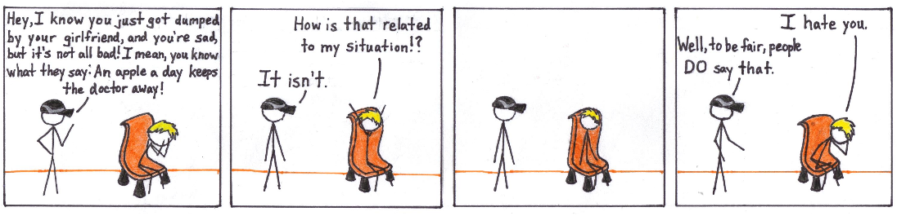
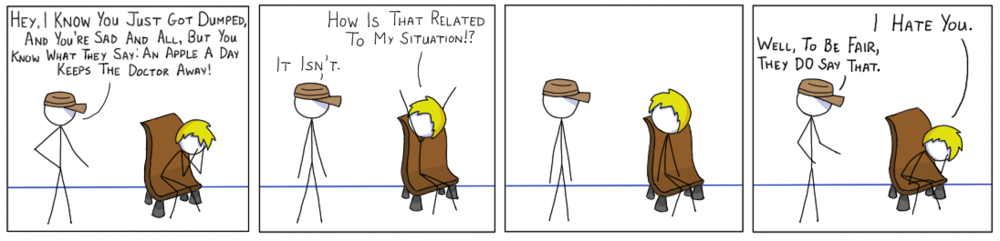

[This](http://drifterswithpencils.com/archive/you-know-what-they-say) remaster is like none other. 

Usually, these afterthoughts are quite short. However, I'd like to point out a few odd things about this one for today. Hopefully, you find them a bit interesting. 

First, the order of operations changed with this one. Usually, I "pencil" in the characters, getting their relative shapes down. Then I trace over it with a thicker "ink", then I color, shade, and then words. (Note the quotes around pencil and ink. Don't pencil and ink on a tablet.) However, I had to come up with the words first, since the first panel was so text heavy. 

Speaking of the first panel, it's been edited quite a bit from the original. It turns out that I write a bit larger using a tablet than a pen, so I found it necessary to cut out some bits. On the plus side, it makes the first panel a lot cleaner.  Less faff is better with comics. 

Original:  

Remaster:  
  

Finally, no. I don't really know a chair that looks like that. I'm just bad at drawing chairs. 

Another thing I'd like to talk about has nothing to do with the comics. The results of the Kanto Classic Online Competition have come in. (If you missed the previous afterthoughts about them, click [here](http://drifterswithpencils.com/blog/kanto-classic-teambuilding) for the teambuilder and [here](http://drifterswithpencils.com/blog/kanto-classic-results) for the battles.) I came in 1893 out of 32220 people, and 51st in Canada. Not even bad. 

-Jan