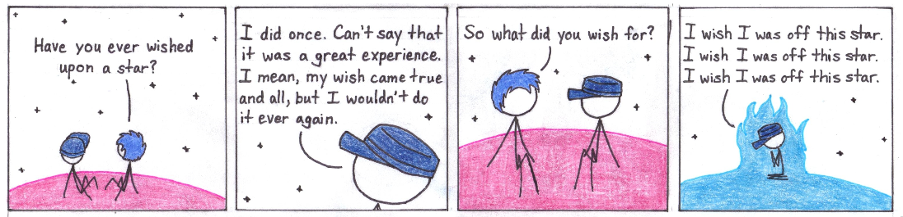

Don't you [wish](http://drifterswithpencils.com/archive/wish) these opening puns were better?

Today's comic is rather special. For a couple of reasons. 

The largest reason is that this comic is exactly the same as the one that appeared in the Gauntlet paper for the University of Calgary, minus the white space between the panels. You could say that I was being lazy, or that I didn't have time. I can't really argue with either. 

However, this is the comic I'm most proud of making. This is because the comic was drawn on paper, and subsequently inverted in MS Paint. Here is the comic before it got inverted. 

The amount of effort put into finding out which pencil crayon makes the colour that I want, and repeatedly scanning and inverting different colours is something I'm more proud of than I probably should be. 

Sure, I suppose I could simply do it digital and have an easier time with it. However, I just...can't. Not with this one. 

Also, there'll be some afterthoughts coming in the next couple of days. A games list and another SoR. If you're interested, feel free to take a look. Otherwise, see you Monday. 

-Jan